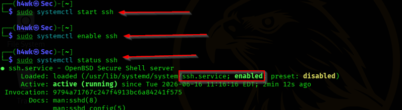
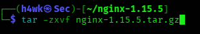
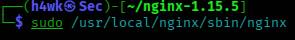
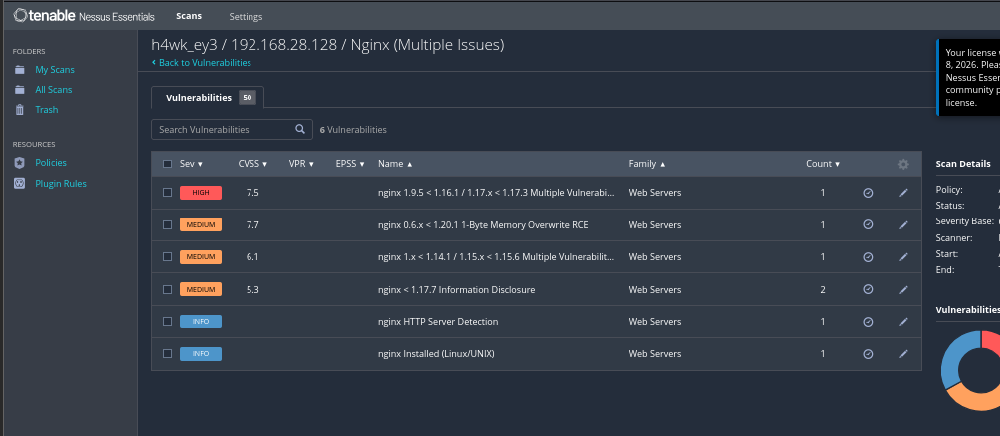
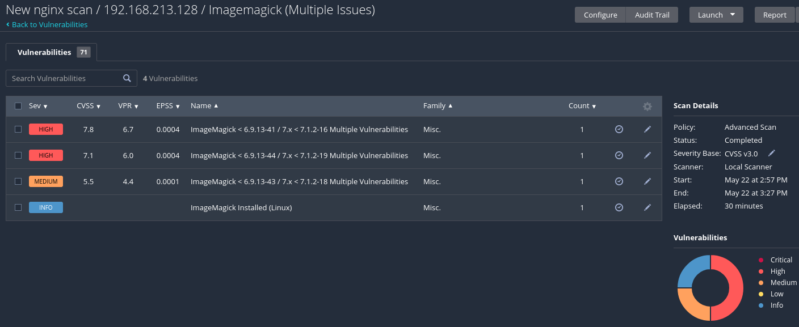
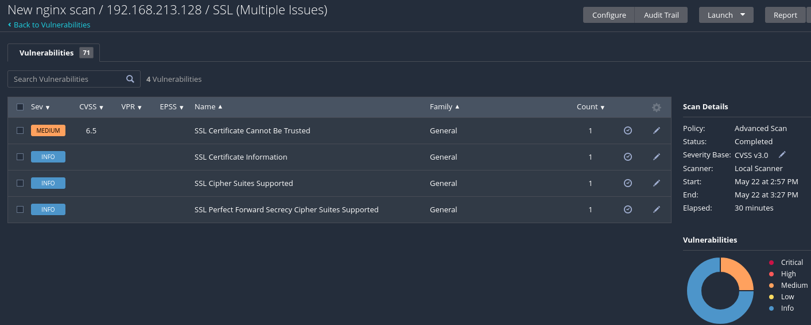

# NGINX Security Hardening & Automated Patching

## Project Overview

This project documents an internal security assessment of an outdated NGINX web server running **NGINX 1.15.5**. The assessment examined the security risks of the outdated installation, including known NGINX vulnerabilities, insecure HTTP-based source retrieval, manual source compilation, SSH exposure, missing integrity verification, and SSL/TLS configuration findings.

The project also demonstrates remediation through **Ansible-based NGINX patching**, followed by version verification.

## Assessment Details

| Item | Details |
|---|---|
| Assessment Type | Internal Security Assessment |
| Target | NGINX Server |
| Initial Version | NGINX 1.15.5 |
| Final Version | NGINX 1.30.1 |
| Vulnerability Scanner | Tenable Nessus |
| Automation Tool | Ansible |
| Platform | Kali Linux |
| Initial Risk Level | Critical |

## Objectives

- Assess the security risks associated with an outdated NGINX installation.
- Identify vulnerabilities using Nessus.
- Document the initial NGINX deployment and configuration validation.
- Identify insecure deployment practices.
- Automate NGINX remediation using Ansible.
- Verify the NGINX installation after remediation.

## Assessment Workflow

```text
Environment Preparation
        ↓
NGINX 1.15.5 Deployment
        ↓
Configuration & Version Verification
        ↓
Nessus Vulnerability Assessment
        ↓
Ansible Installation
        ↓
Ansible Playbook Creation & Configuration
        ↓
Automated NGINX Patching
        ↓
Final Version Verification
```

## Environment Preparation

The assessment environment was prepared on Kali Linux. The Kali archive keyring was configured for trusted package operations, and OpenSSH Server was installed, started, enabled, and verified.

### Key commands

```bash
sudo wget https://archive.kali.org/archive-keyring.gpg -O /usr/share/keyrings/kali-archive-keyring.gpg
apt install openssh-server
sudo systemctl start ssh
sudo systemctl enable ssh
sudo systemctl status ssh
```

## NGINX Deployment

The assessment intentionally deployed the outdated **NGINX 1.15.5** release from source.

### Key commands

```bash
wget http://nginx.org/download/nginx-1.15.5.tar.gz
apt install build-essential libpcre3 libssl-dev
tar -zxvf nginx-1.15.5.tar.gz
./configure
make
sudo make install
sudo /usr/local/nginx/sbin/nginx
sudo /usr/local/nginx/sbin/nginx -t
sudo /usr/local/nginx/sbin/nginx nginx -v
```

The initial version check established **NGINX 1.15.5** as the vulnerable baseline.

## Vulnerability Assessment

Tenable Nessus was used to assess the deployed environment.

The report documented findings involving:

- Multiple NGINX vulnerabilities
- ImageMagick vulnerabilities
- SSL/TLS configuration and certificate findings
- Additional security weaknesses associated with the deployment

### Key security observations

| Finding | Risk Level | Recommended Remediation |
|---|---|---|
| Outdated NGINX Version | Critical | Upgrade to the latest stable NGINX release |
| Multiple NGINX Vulnerabilities | High | Upgrade to the latest stable NGINX release |
| HTTP Download | High | Use HTTPS for package/source retrieval |
| Missing Integrity Verification | High | Verify GPG signatures/checksums before installation |
| SSH Exposure | Medium | Restrict SSH access using firewall rules |
| Manual Compilation | Medium | Prefer managed package installations where appropriate |
| Weak TLS Defaults | Medium | Use strong TLS configuration and disable weak options |

## Ansible Remediation

Ansible was introduced to automate the NGINX update process.

### Installation and verification

```bash
sudo apt install ansible -y
ansible --version
```

### Playbook creation

```bash
nano update_nginx.yml
```

The playbook was configured to manage the NGINX installation and service.

### Playbook execution

```bash
ansible-playbook update_nginx.yml --ask-become-pass
```

The execution completed successfully with:

```text
failed=0
```

### Final verification

```bash
nginx -version
```

The final verification showed:

```text
nginx version: nginx/1.30.1
```

## Evidence

The screenshots below are arranged in the same logical order as the assessment workflow.

### 1. Kali Archive Key Configuration


The Kali archive keyring was downloaded and saved to the system keyring directory.

### 2. SSH Service Installation and Verification



The SSH service was started, enabled, and its running status was verified.

### 3. NGINX 1.15.5 Download


The outdated NGINX 1.15.5 source archive was downloaded from the NGINX website.

### 4. NGINX Build Dependencies


Build dependencies required for compiling NGINX from source were installed.

### 5. NGINX Source Extraction



The NGINX 1.15.5 source archive was extracted.

### 6. NGINX Compilation and Installation


The NGINX source was configured, compiled, and installed using the source build process.

### 7. NGINX Server Startup



The manually installed NGINX server was started using the NGINX binary.

### 8. NGINX Configuration Validation


The NGINX configuration was tested with `nginx -t`, confirming that the configuration syntax was successful.

### 9. Initial NGINX Version Verification


The initial installation was verified as **NGINX 1.15.5**, establishing the outdated baseline.

### 10. Nessus NGINX Vulnerability Findings



The Nessus scan displayed multiple NGINX findings, including vulnerabilities affecting the installed NGINX version and related web-server detection findings.

### 11. Nessus ImageMagick Vulnerability Findings



The Nessus scan displayed multiple ImageMagick vulnerability findings affecting the assessed environment.

### 12. Nessus SSL Findings



The Nessus scan displayed SSL/TLS findings covering certificate trust, certificate information, supported cipher suites, and Perfect Forward Secrecy cipher suites.

### 13. Ansible Installation


Ansible was installed using the APT package manager.

### 14. Ansible Version Verification


The installed Ansible version was verified using `ansible --version`.

### 15. Creating the NGINX Update Playbook


The `update_nginx.yml` playbook file was created using the Nano text editor.

### 16. Ansible NGINX Playbook Configuration


The playbook was configured with tasks for managing the NGINX installation, updating package information, installing the latest NGINX package, and starting and enabling the NGINX service.

### 17. Successful Ansible Playbook Execution


The Ansible playbook was executed with elevated privileges. The play recap shows the execution completed with **failed=0**.

### 18. Final NGINX Version Verification


The final verification confirmed that NGINX was updated to **version 1.30.1**.

## Project Report

The complete technical assessment report is available here:

[View the NGINX Security Hardening Report](report/nginx-security-hardening-report.docx)

## Key Takeaway

This project demonstrates a practical security assessment and remediation workflow:

**Identify → Assess → Remediate → Automate → Verify**

The assessment shows how outdated server software can expose an environment to known vulnerabilities and how automated patch management can improve consistency and reduce manual administrative effort.
