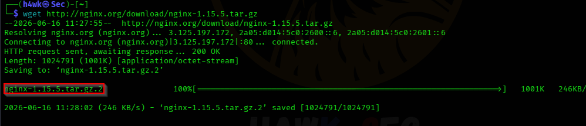
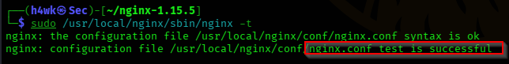
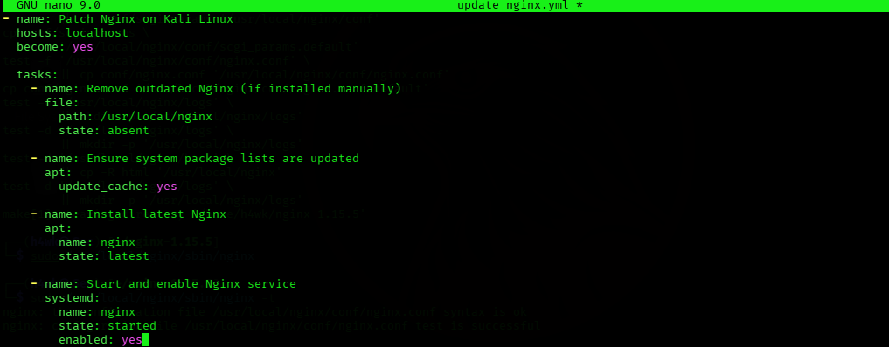
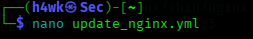
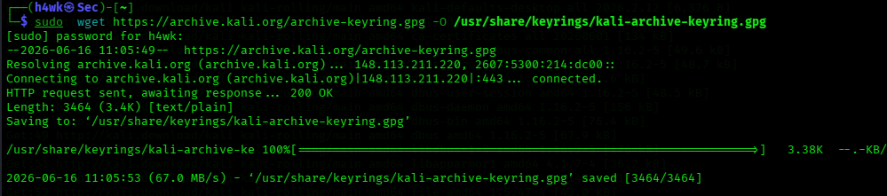
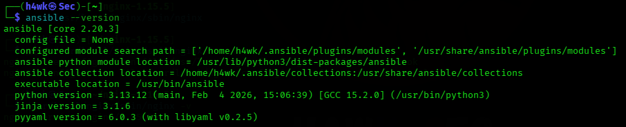
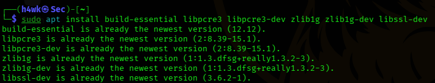
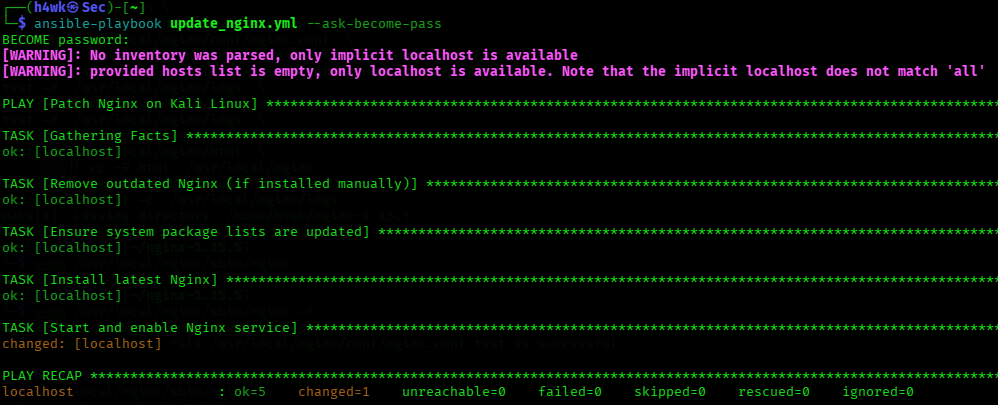

# NGINX Security Hardening & Patching

## Project Overview

This project documents an internal security assessment of an outdated NGINX web server running NGINX v1.15.5. The assessment examined the security risks associated with an outdated installation, insecure package retrieval, manual compilation, SSH exposure, missing integrity verification, and weak TLS defaults.

The project also documents using Ansible to automate NGINX updates and verify the resulting installation.

## Assessment Type

**Internal Security Assessment**

**Target:** NGINX Server (v1.15.5)

**Risk Level:** Critical

## Objectives

- Assess the security risks of an outdated NGINX installation.
- Identify vulnerabilities and insecure deployment practices.
- Document NGINX installation and configuration validation.
- Apply remediation recommendations.
- Use Ansible to automate NGINX patching and verification.

## Environment Preparation

The assessment included preparation of the environment and SSH configuration. The report documents installation and startup of OpenSSH Server and the use of the Kali archive keyring for trusted package installation.

## NGINX Deployment

The assessment documented downloading NGINX 1.15.5, installing build dependencies, extracting the source code, compiling and installing NGINX, starting the service, and validating the configuration.

Key commands documented in the report include:

```bash
wget http://nginx.org/download/nginx-1.15.5.tar.gz
apt install build-essential libpcre3 libssl-dev
tar -zxvf nginx-1.15.5.tar.gz
./configure
make
make install
/usr/local/nginx/sbin/nginx
sudo /usr/local/nginx/sbin/nginx -t
```

## Vulnerability Assessment

The report identified the following security issues:

| Finding | Risk | Recommended Remediation |
|---|---|---|
| Outdated NGINX version | Critical | Upgrade to the latest stable NGINX release |
| Multiple NGINX vulnerabilities | High | Upgrade to the latest stable NGINX release |
| HTTP download | High | Use HTTPS for package downloads |
| Missing integrity verification | High | Verify GPG signatures before installation |
| SSH exposure | Medium | Restrict SSH access using firewall rules |
| Manual compilation | Medium | Use package manager installations for updates |
| Weak TLS defaults | Medium | Use strong cipher suites and disable weak ones |

## Ansible Patching

The project documents installing Ansible, verifying the installation, creating an `update_nginx.yml` playbook, executing it with elevated privileges, and verifying the NGINX version afterward.

Example commands:

```bash
sudo apt install ansible -y
ansible --version
nano update_nginx.yml
ansible-playbook update_nginx.yml --ask-become-pass
nginx -version
```


## Evidence

The following evidence documents the deployment, vulnerability assessment, and automated patching of the NGINX server.

### 1. Kali Archive Key Configuration



The Kali archive key was downloaded and configured to support trusted package installation.

### 2. SSH Service Installation and Verification



The OpenSSH service was installed, started, enabled, and its status was verified.

### 3. Downloading NGINX 1.15.5


The outdated NGINX 1.15.5 source archive was downloaded for the security assessment.

### 4. Installing NGINX Dependencies



Required build dependencies were installed before compiling NGINX from source.

### 5. Extracting the NGINX Source


The NGINX 1.15.5 source archive was extracted.

### 6. Configuring and Compiling NGINX


The NGINX source was configured and the installation process was initiated using `make install`.

### 7. Starting the NGINX Server


The manually compiled NGINX server was started using the NGINX binary.

### 8. NGINX Configuration Validation


The NGINX configuration was tested using `nginx -t` and reported successful configuration syntax.

### 9. Initial NGINX Version Verification



The initial installation was verified as NGINX 1.15.5, establishing the outdated baseline.

### 10. Nessus NGINX Vulnerability Findings



Nessus identified six findings associated with NGINX, including multiple NGINX vulnerabilities, a 1-byte memory overwrite RCE finding, information disclosure, HTTP server detection, and NGINX installation detection.

### 11. Nessus ImageMagick Vulnerability Findings


Nessus identified four ImageMagick findings, including three multiple-vulnerability findings affecting ImageMagick versions and an ImageMagick installation detection result.

### 12. Nessus SSL Security Findings


Nessus identified four SSL-related findings: SSL Certificate Cannot Be Trusted, SSL Certificate Information, SSL Cipher Suites Supported, and SSL Perfect Forward Secrecy Cipher Suites Supported.

### 13. Installing Ansible


Ansible was installed using the APT package manager with the `sudo apt install ansible -y` command.

### 14. Verifying Ansible Installation


The Ansible installation was verified using `ansible --version`, showing Ansible Core 2.20.3 and the associated Python and Jinja versions.

### 15. Creating the NGINX Update Playbook



The `update_nginx.yml` playbook file was created and opened using the Nano text editor.

### 16. Configuring the NGINX Ansible Playbook



The `update_nginx.yml` playbook was configured with tasks to manage the NGINX installation, update system packages, install the latest NGINX package, and start and enable the NGINX service.

### 17. Executing the NGINX Ansible Playbook


The playbook was executed using `ansible-playbook update_nginx.yml --ask-become-pass`. The execution completed successfully with `failed=0` in the play recap.

### 18. Final NGINX Version Verification



The final version check confirmed that NGINX was updated successfully to version 1.30.1.

---

### Project Report

The complete technical assessment report is available in:

`report/nginx-security-hardening-report.docx`

### Project Report

The complete technical assessment report is available in:

`report/nginx-security-hardening-report.docx`

### Project Report

The complete technical assessment report is available in:

`report/nginx-security-hardening-report.docx`


## Key Takeaway

The assessment demonstrates the security risks of maintaining an outdated NGINX installation and the value of automated patch management. The documented Ansible workflow helps simplify repetitive administrative tasks, reduce human error, and improve consistency across deployments.
